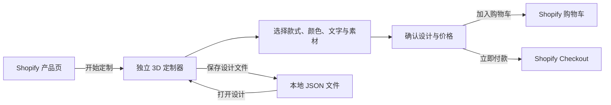
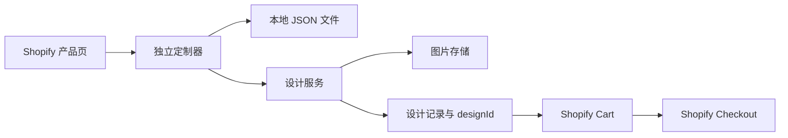

# 消费者定制闭环与设计文件设计说明

## 目标

将 3D 球衣定制器设计为独立页面：消费者从 Shopify 产品页进入，在定制器中完成设计、确认结果，再选择加入 Shopify 购物车或直接进入 Shopify Checkout。定制器不自行收款。

本说明同时保留本地设计文件能力：用户可下载和重新打开自己的设计；后续接入服务器后，上传图片和生产所需完整设计由服务器保存。

## 消费者路径



### 进入定制器

- Shopify 产品页的“开始定制”链接打开独立页面，并携带产品与变体标识。
- 定制器显示与入口一致的商品名称、款式、基础价格和主图。
- 价格、变体和可用定制选项在服务器接入后必须由 Shopify 或服务端确认；不信任链接中传入的价格。
- 用户随时可以返回商品页；未保存的编辑状态以清晰提示提醒用户先下载设计文件。

### 编辑与确认

编辑页面按消费者完成任务的顺序组织功能，而不是按技术模块堆叠：

1. 选择款式与颜色。
2. 添加文字、号码、图案、徽章或上传图片。
3. 在前后面及袖子区域检查素材位置、大小和旋转。
4. 进入确认步骤，集中显示商品、数量、价格、文字内容、已添加素材和预览图。
5. 从确认步骤选择“加入购物车”或“立即付款”。

顶部保留撤销、重做、保存设计和打开设计。撤销与重做用于编辑，保存与打开用于跨会话恢复；不提供分享设计功能。

## 三期范围与检查点

### 第一期：本地可恢复编辑

**目标：** 让消费者能安心试设计、撤销操作，并把完整设计保存在自己的设备上。

**包含：**

- 撤销/重做，最多 50 个设计快照。
- 下载与打开 `.json` 设计文件。
- 导入后恢复颜色、文字号码、预设素材、上传图片及素材区域、位置、大小、旋转。
- 独立的设计确认页或确认步骤，展示当前商品和完整配置。

**不包含：** 服务器上传、真实价格计算、Shopify 加购和支付。

**验证：** 修改设计后可撤销/重做；保存包含上传图片的文件并重新打开后完整还原；错误文件不会覆盖当前设计。

### 第二期：服务器保存设计

**目标：** 将需要生产的设计从浏览器可靠保存到服务器。

**包含：**

- 上传图片通过服务器获得素材 ID，不再长期保留 Data URL。
- `POST /designs` 保存完整设计、产品/变体、预览图与素材 ID，返回唯一 `designId`。
- 设计确认页显示保存状态；保存失败时保留当前编辑内容并允许重试或下载本地文件。

**不包含：** 用户账户、分享链接、多人协作、直接外部收款。

**验证：** 上传素材、保存设计、重新读取设计均能还原；失败时不丢失本地编辑状态。

### 第三期：Shopify 加购与付款

**目标：** 让已保存的定制设计进入 Shopify 的标准购物和支付流程。

**包含：**

- 服务端校验 `designId` 所属产品和变体，并确认其可用于下单。
- “加入购物车”创建或更新 Shopify Cart，跳回 Shopify 购物车。
- “立即付款”创建 Shopify Cart 后跳转其 `checkoutUrl`。
- 购物车行项目属性只保存 `designId`、简短配置摘要和预览地址；生产端按 `designId` 读取完整设计。

**不包含：** 定制器自己的支付页面、在浏览器中保存 Shopify 管理员令牌、把完整 JSON 或图片 Data URL 写入订单属性。

**验证：** 通过测试店铺完成一次“定制—保存—加购—查看购物车属性”和一次“定制—保存—立即付款跳转”链路；在订单后台可按 `designId` 找到完整设计。

## 本地设计文件

设计文件使用版本化 JSON，供第一期恢复设计与第二期故障兜底：

```json
{
  "format": "jersey-design",
  "version": 1,
  "productId": "fn8788-match-jersey",
  "variantId": "shopify-variant-id",
  "savedAt": "2026-07-14T00:00:00.000Z",
  "state": {
    "selectedOptions": {},
    "overrides": {
      "printName": "PLAYER",
      "printNumber": "16",
      "decorations": []
    }
  }
}
```

- 预设素材只保存预设 ID。
- 第一期的上传素材保留 Data URL；第二期保存成功后改为服务器素材 ID。
- 不保存临时 UI 状态，例如当前展开面板、提示文字或鼠标选中态。
- 只接受 `format` 为 `jersey-design`、`version` 为 `1` 且产品一致的文件；读取或校验失败时，显示明确错误而不修改当前设计。

## 系统边界



- **独立定制器：** 负责用户交互、3D 预览、本地文件和设计确认，不直接处理支付。
- **设计服务：** 负责图片上传、设计持久化、`designId`、预览图、产品/变体校验以及 Shopify Cart 调用。
- **Shopify：** 负责商品与变体、可信价格、购物车、库存、税费、支付和订单。
- **现有 Shopify 嵌入版：** 先保留但不作为本期主路径；第一期只修改独立页面，避免把尚未确定的服务端逻辑塞入主题。

Shopify 的 Cart API 可创建购物车并返回 `checkoutUrl`；购物车链接也可传入商品与行项目属性。因此“立即付款”应跳转 Shopify Checkout，而不是在独立定制器中复制支付流程。参考：[Shopify Cart API](https://shopify.dev/docs/api/storefront/latest/objects/cart)、[Shopify Cart Permalinks](https://help.shopify.com/en/manual/checkout-settings/cart-permalink)。

## 错误处理与保护

- 导入文件不合法、产品不匹配或版本不支持：保留当前设计并给出可理解提示。
- 本地保存失败：提示用户重试，当前编辑不清空。
- 第二期素材上传或保存设计失败：允许重试或下载本地设计文件；不允许进入加购/付款。
- 第三期 Cart 创建或 Checkout 跳转失败：保留已保存的 `designId` 与当前页面，提示重试；不重复创建订单。
- 不在客户端保存 Shopify 管理员令牌、服务器密钥或支付信息。

## 验收标准

1. 消费者能从产品入口理解下一步是“开始定制”，在定制器内完成设计并进入确认步骤。
2. 第一期开启后，保存、关闭/刷新、重新打开设计文件，结果与保存前一致，包括上传图片。
3. 第二期开启后，每个可用于下单的设计都有唯一 `designId`、预览和可追溯的素材记录。
4. 第三期开启后，加入购物车和立即付款均进入 Shopify 的对应页面，订单/购物车可关联到正确的 `designId`。
5. 任何保存、导入、上传或下单错误都不会悄悄丢失用户正在编辑的设计。

## 非目标

- 不做设计分享、账户、多人协作或定制器内支付。
- 不直接修改线上 Shopify 主题、产品、库存、订单或结账设置。
- 不在第一期实现网格投影贴花、自动背景去除、AI Logo、批量姓名号码或复杂图层管理。
