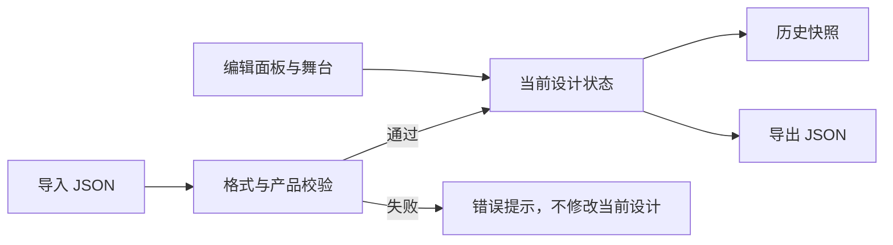

# 本地设计文件与编辑历史设计说明

## 目标

为独立运行的 3D 球衣定制器增加本地保存、导入恢复、撤销和重做能力。用户不需要登录、不需要分享设计，也不依赖 Shopify 页面或服务器。

## 本期范围

### 用户可用功能

1. 在编辑器顶部使用“撤销”和“重做”回退或恢复最近的定制操作。
2. 使用“保存设计”下载一个 `.json` 文件。
3. 使用“打开设计”选择此前下载的 `.json` 文件，并恢复当时的颜色、文字、号码、素材及素材变换。
4. 保存文件包含用户本地上传图片的 Data URL，因此导入后无需再次选择图片。

### 保存内容

设计文件采用固定版本结构：

```json
{
  "format": "jersey-design",
  "version": 1,
  "productId": "fn8788-match-jersey",
  "savedAt": "2026-07-14T00:00:00.000Z",
  "state": {
    "selectedOptions": {},
    "overrides": {
      "printName": "PLAYER",
      "printNumber": "16",
      "decorations": []
    }
  }
}
```

- 预设素材保留已有素材标识；不复制预设图片本身。
- 上传素材保留 `source` Data URL；导入后可直接渲染。
- 不保存临时 UI 状态，例如当前展开的面板、提示文字或鼠标选中态。

### 导入保护

- 仅接受 `format` 为 `jersey-design` 且 `version` 为 `1` 的 JSON 文件。
- 文件所属 `productId` 必须与当前产品一致。
- 文件无法读取、JSON 格式错误、版本不支持或产品不匹配时，显示明确错误提示，不改变当前设计。
- 文件中缺少可选字段时使用当前产品的默认值补齐；不允许以错误数据伪装为成功导入。

## 编辑历史

- 每一次可保存设计状态的更新进入历史记录；包括颜色、面料、文字号码、素材添加/删除、素材区域和变换。
- 历史最多保留 50 个快照，超出后删除最旧快照。
- 导入成功后以导入结果作为新的历史起点，旧历史清空，避免跨设计撤销造成混乱。
- 撤销与重做按钮在没有可执行操作时禁用；键盘快捷键不是本期必需功能。

## 架构边界



- 新增独立的设计文件序列化/解析模块，不在 React 页面组件中混入文件格式和校验规则。
- 新增独立的编辑历史状态模块，供独立页面复用；不改变 Three.js 渲染器对状态的消费方式。
- 本期只改独立定制器页面。现有 Shopify 嵌入版与订单属性序列化逻辑保持不变。

## 非目标

- 不做分享链接、账户、登录、云端草稿、多人协作或服务器上传。
- 不接 Shopify 购物车、价格、库存、订单或主题页面。
- 不把用户上传图片发送到任何外部服务。
- 不实施网格投影贴花、自动背景去除、AI Logo、批量姓名号码或复杂图层管理。

## 验收标准

1. 对颜色、文字和徽章进行修改后，撤销和重做均能恢复正确状态。
2. 保存包含上传图片的设计文件，再导入后，上传图片与其位置、大小、旋转均保持一致。
3. 导入错误文件或其他产品的设计文件时，当前画面与配置不发生变化，并出现错误提示。
4. 自动化测试覆盖序列化、导入校验与历史状态；浏览器实际完成一次“修改—保存—刷新/重开—导入恢复”链路。

## 后续衔接

第二期再逐步增加 Owayo 风格的模板、文字样式、Logo 图层和区域化颜色。第三期新增服务端后，设计文件结构保留不变；上传素材的 Data URL 将转为服务端素材 ID，再把设计配置接入 Shopify 下单。
